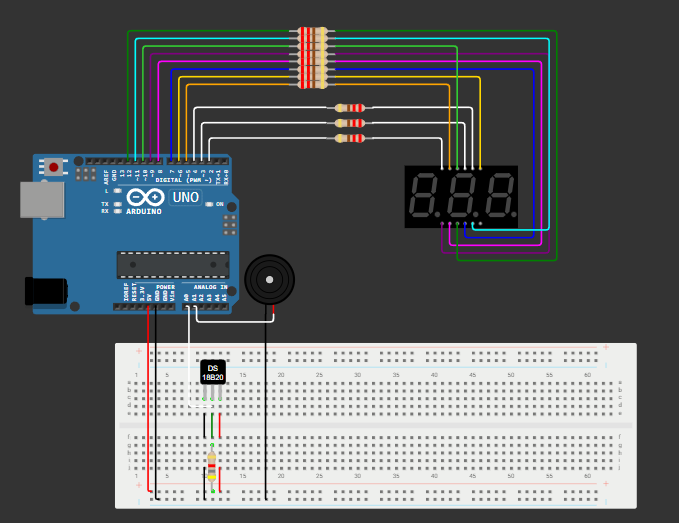
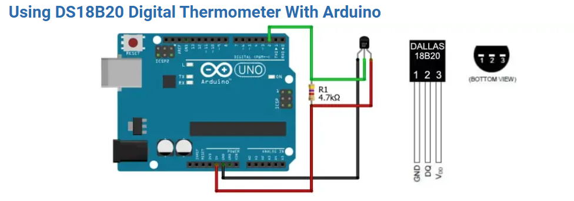
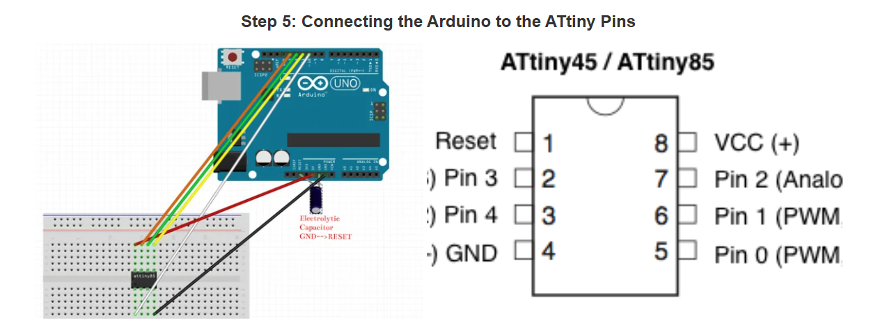
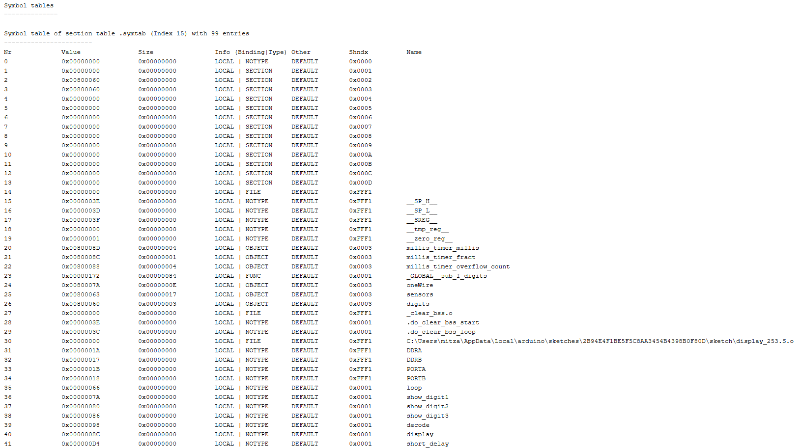

# Termometru digital cu ATTINY861A și afișaj 7 segmente (3 cifre)

Acest proiect implementează un termometru digital care utilizează un microcontroler ATTINY861A, un senzor de temperatură DS18B20 și un afișaj cu 3 cifre de tip 7 segmente (anod comun). 
Codul a fost scris în Arduino IDE și se încarcă prin ISP, cu ajutorul unei plăci Arduino Uno.
Logica hardware este asemnătoare simulării efectuate în Wokwi - https://wokwi.com/projects/430525919167703041 cu mențiunea ca acum Arduino Uno este folosit pentru a încărca codul în
ATTINY861A, microcontroller care acum se ocupă de logica sistemului. 

De menționat ca o dată cu implementarea fizică s-a scos și buzzerul întrucât ultimul pin folosibil de pe microcontroller era folosit pentru a încărca codul.

## Componente utilizate

- ATTINY861A – microcontroler principal
- DS18B20 – senzor de temperatură digital
- Afișaj 7 segmente cu 3 cifre, anod comun
- Arduino Uno – folosit ca programator ISP
- Fire, breadboard, alimentare 5V, rezistență 4.75 kOhmi pentru senzorul de temperatură, rezistențe de 220 Ohmi pentru display conform Bibliografie 1

## Conexiuni hardware (ATTINY861A)

### Alimentare:
- Pin 4 (VCC) → 5V
- Pin 15 (AVCC) → 5V
- Pin 5 (GND) → GND
- Pin 16 (AGND) → GND

### Senzor DS18B20:
- Pin 9 (PB6) → Pin de date DS18B20
- Rezistență de 4.7kΩ între date și VCC 
 - conform Bibliografie 4

### Display – Segmente (A–G + DP):
(Pini controlați direct din cod în ordinea PA7→PA0, adică digital 7→0)

- PA7 (pin 11) → Segment A - sus
- PA6 (pin 12) → Segment B - dreapta sus
- PA5 (pin 13) → Segment C - dreapta jos
- PA4 (pin 14) → Segment D - jos           
- PA3 (pin 17) → Segment E - stanga jos
- PA2 (pin 18) → Segment F - stanga sus
- PA1 (pin 19) → Segment G - mijloc
- PA0 (pin 20) → DP (punct zecimal)

### Display – Cifre (control anod):
- PB3 (pin 6) → DIG1 (cifra 1 – stânga)
- PB4 (pin 7) → DIG2 (cifra 2 – mijloc)
- PB5 (pin 8) → DIG3 (cifra 3 – dreapta)

Poziția segmentelor și pinii corespunzători sunt luate din Bibliografie 2,3 

---

## Programarea ATTINY861A din Arduino IDE

### Conexiuni între Arduino Uno și ATTINY861A (pentru programare ISP):

- D10 (Arduino) → Pin 10 (PB7 / RESET)
- D11 (Arduino) → Pin 1 (PB0 / MOSI)
- D12 (Arduino) → Pin 2 (PB1 / MISO)
- D13 (Arduino) → Pin 3 (PB2 / SCK)
- GND (Arduino) → GND comun
- 5V (Arduino) → VCC + AVCC (alimentare ATTINY)

---

### Pași pentru uploadul codului în ATTINY861A:

1. S-a deschis Arduino IDE
2. S-a încărcat `ArduinoISP.ino` pe placa Arduino Uno
3. S-a deschis meniul File > Preferences și adaugă URL:
4. Din Boards Manager, s-a instalat: ATTinyCore by Spence Konde
5. S-au setat următoarele:
- Placă: `ATtiny261/461/861 (no bootloader)`
- Chip: `ATtiny861A`
- Clock: `8 MHz (internal)`
- Programmer: `Arduino as ISP`
6. Am folosit la Tools > Burn Bootloader (pentru setarea fuse-urilor)
7. Am deschis sketchul cu codul proiectului
8. Am încărcat codul cu: Sketch > Upload Using Programmer
Încărcarea s-a efectuat folosind Bibliografie 5, respectiv ChatGPT pentru sugerarea bibliotecii specifică ATTINY861A - ATTinyCore by Spence Konde

### Cod

S-au propus 2 idei de implementare, una exclusiv in C si cealalta cu citirea senzorului in C si afișarea în assembly

### Probleme înâmpinate

1. Cea mai mare problema a fost nereușirea citirii senzorului direct în assembly.
Citirea senzorului de temperatură DS18B20 direct în limbaj Assembly nu a fost viabilă deoarece protocolul OneWire necesită timpi extrem de preciși, operații de bit-banging complexe și o secvență strictă de comenzi. Acestea sunt dificil de implementat manual în Assembly fără acces la librării dedicate. În schimb, folosirea unei biblioteci precum DallasTemperature în C a simplificat tot procesul și a permis obținerea temperaturii corect în câteva linii de cod, lăsând restul funcționalității să fie scrisă în Assembly acolo unde are sens.

2. Dupa rezolvarea problemei de mai sus a apărut necesitatea trimiterii unei variabile din codul C în cel Assembly, variabilă a cărei adresa de memorie nu o cunoșteam.
S-a rezolvat folosind un convertor online - https://www.sunshine2k.de/coding/javascript/onlineelfviewer/onlineelfviewer.html - care să permită citirea fișierului elf rezultat din build. Fișierul elf conține printre metadatele programului și adresele de memorie utilizate.

3. La partea hardware a existat riscul arderii led-urilor
Dar conform Bibliografie - 1, am montat rezistențe de 220 Ohmi între pinii microcontroller-ului și pinii display-ului.

4. Elminarea buzzer-ului
Pentru că ultimul pin disponibil și anume 6 a fost folosit pentru încărcarea datelor, s-a renunțat la buzzer pentru implementare.

### Bibliografie

1. https://www.quora.com/What-is-the-purpose-of-the-resistors-at-the-output-of-the-decoder-IC-before-connecting-it-to-the-7-segment-display
2. https://docs.wokwi.com/parts/wokwi-7segment
3. Datasheet display - http://datasheet.elcodis.com/pdf2/100/92/1009249/ltc-5648wc.pdf
4. Conectare senzor temperatură cu pull up - https://www.make-it.ca/arduino-ds18b20/
5. Porgramare Attiny folosind Arduino - https://www.instructables.com/How-to-Program-an-Attiny85-From-an-Arduino-Uno/

