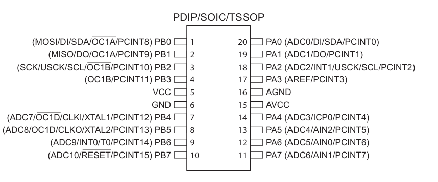
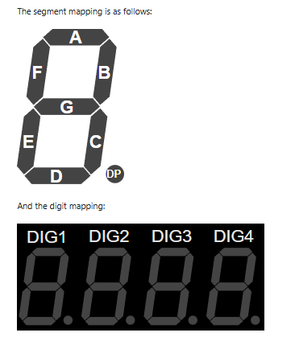

# Digital Thermometer with ATTINY861A and 7-Segment Display (3 digits)

This project implements a digital thermometer that uses an ATTINY861A microcontroller, a DS18B20 temperature sensor, and a 3-digit 7-segment common-anode display.
The code was written in Arduino IDE and uploaded via ISP using an Arduino Uno board.
The hardware logic is similar to the simulation performed in Wokwi - https://wokwi.com/projects/430525919167703041 with the mention that now Arduino Uno is used only for uploading code into the ATTINY861A microcontroller, which now handles the system logic.

It should be mentioned that in the physical implementation the buzzer was removed, since the last usable pin on the microcontroller was used for code uploading.

## Components Used

- ATTINY861A – main microcontroller
- DS18B20 – digital temperature sensor
- 3-digit 7-segment common-anode display
- Arduino Uno – used as ISP programmer
- Wires, breadboard, 5V power supply, 4.75 kOhm resistor for the temperature sensor, 220 Ohm resistors for the display as per Bibliography 1

## CHardware Connections (ATTINY861A)

### Power:

- Pin 4 (VCC) → 5V
- Pin 15 (AVCC) → 5V
- Pin 5 (GND) → GND
- Pin 16 (AGND) → GND

### DS18B20 Sensor:

- Pin 9 (PB6) → DS18B20 data pin
- 4.7kΩ resistor between data and VCC
   - conform Bibliografie 4

### Display – Segments (A–G + DP):

(Pins are directly controlled in code in the order PA7→PA0, meaning digital 7→0)

- PA7 (pin 11) → Segment A - top
- PA6 (pin 12) → Segment B - top right
- PA5 (pin 13) → Segment C - bottom right
- PA4 (pin 14) → Segment D - bottom
- PA3 (pin 17) → Segment E - bottom left
- PA2 (pin 18) → Segment F - top left
- PA1 (pin 19) → Segment G - middle
- PA0 (pin 20) → DP (decimal point)

Display – Digits (anode control):

- PB3 (pin 6) → DIG1 (digit 1 – left)
- PB4 (pin 7) → DIG2 (digit 2 – middle)
- PB5 (pin 8) → DIG3 (digit 3 – right)

Segment positions and pin mappings are based on Bibliography 2, 3

---

## Programming the ATTINY861A from Arduino IDE

### Connections between Arduino Uno and ATTINY861A (for ISP programming):

- D10 (Arduino) → Pin 10 (PB7 / RESET)
- D11 (Arduino) → Pin 1 (PB0 / MOSI)
- D12 (Arduino) → Pin 2 (PB1 / MISO)
- D13 (Arduino) → Pin 3 (PB2 / SCK)
- GND (Arduino) → common GND
- 5V (Arduino) → VCC + AVCC (ATTINY power supply)
  

---

### Steps to upload code to ATTINY861A:

1. I Opened Arduino IDE
2. I Uploaded `ArduinoISP.ino` to the Arduino Uno
3. Open File > Preferences and add the URL:
4. In Boards Manager, install: ATTinyCore by Spence Konde
5. Set the following options:

- Board: `ATtiny261/461/861 (no bootloader)`
- Chip: `ATtiny861A`
- Clock: `8 MHz (internal)`
- Programmer: `Arduino as ISP`

6. I used Tools > Burn Bootloader (to set the fuses)
7. I opened the project sketch
8. I Uploaded the code with: Sketch > Upload Using Programmer
   The upload was performed using Bibliography 5, and ChatGPT was consulted to suggest the specific library for ATTINY861A – ATTinyCore by Spence Konde.

### Code

Two implementation ideas were proposed: one entirely in C, and another with the sensor read in C and display handled in assembly.

### Problems Encountered

1. Main issue: inability to read the sensor directly in assembly
   Reading the DS18B20 temperature sensor directly in assembly was not viable because the OneWire protocol requires extremely precise timing, complex bit-banging operations, and a strict command sequence. These are hard to implement manually in assembly without access to dedicated libraries. Instead, using a library like DallasTemperature in C simplified the entire process and allowed accurate temperature readings with just a few lines of code, leaving the rest of the functionality to be implemented in assembly where appropriate.

2. Next issue: passing a variable from C to assembly, not knowing its memory address
   This was resolved by using an online ELF file reader - https://www.sunshine2k.de/coding/javascript/onlineelfviewer/onlineelfviewer.html - which allowed reading the .elf file generated after the build. The ELF file contains, among other program metadata, the used memory addresses.
   

3. Hardware issue: risk of burning LEDs
   According to Bibliography 1, 220 Ohm resistors were placed between the microcontroller pins and the display pins to prevent this.

4. Buzzer removal
   Because the last available pin (pin 6) was used for data upload, the buzzer had to be removed in the physical implementation.

### Bibliography

1. https://www.quora.com/What-is-the-purpose-of-the-resistors-at-the-output-of-the-decoder-IC-before-connecting-it-to-the-7-segment-display
2. https://docs.wokwi.com/parts/wokwi-7segment
3. Datasheet display - http://datasheet.elcodis.com/pdf2/100/92/1009249/ltc-5648wc.pdf
4. Temperature sensor connection with pull-up - https://www.make-it.ca/arduino-ds18b20/
5. Programming Attiny using Arduino - https://www.instructables.com/How-to-Program-an-Attiny85-From-an-Arduino-Uno/
